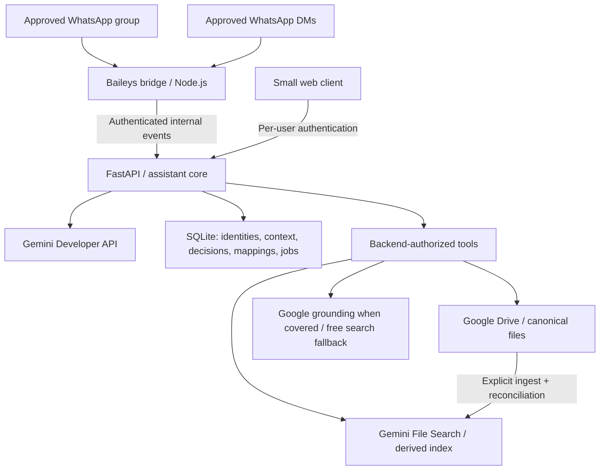

# Nedal’s Smart Assistant: researched MVP architecture

Decision date: 7 October 2026. Recommendations below distinguish vendor facts from our design choices. This is a phased build, not a claim that all integrations already work. Owner clarification: project documents are not highly confidential; prioritize the free tier and do not enable paid billing solely for different data-use terms. Team authorization and credential security still apply.

Implementation update, 8 October 2026: renamed the product and repository to **Nedal’s Smart Assistant**, retaining the same project scope and existing configuration compatibility. Basic Gemini chat and a real Gemini → Drive tool → linked answer passed live checks. The approved-sender Baileys bridge is linked, its test group pinned, and its login survives restarts; outgoing jobs have completed. Drive OAuth and writable-folder access are verified. Scoped search/metadata/folder operations and attachment ingestion are implemented; a live setup-status upload into Inbox and an identical-file retry verified duplicate reuse. Full WhatsApp attachment acceptance remains to be exercised. Managed PDF retrieval is now implemented with multimodal File Search, revision filtering and mapped citations. Structured memory, web search, web UI and cloud deployment remain later increments. The owner phone, selected group and Drive root are stored in ignored local configuration rather than this document.

## Recommended architecture

One persistent Linux VM runs the backend, one bridge instance, and a small database-backed job worker. No LangGraph, Redis, vector server, Kubernetes, or autonomous agent swarm. The web client can run locally and reach the backend through an authenticated tunnel; host it behind HTTPS only when useful.

Provider interfaces separate chat, retrieval, Drive, search, and messaging. Channel adapters normalize events; they do not decide authorization. Models propose tools; the backend validates arguments, actor permissions, resource scope, and permitted actions before execution.

## 1. WhatsApp: use Baileys, prove groups first

| Approach | Group/DM/media fit | Reliability and operations | Cost and decision |
|---|---|---|---|
| Official Cloud API / official business gateway | DMs and media; official Groups API exists, but has eligibility and small-group restrictions | Supported API, webhook delivery, no linked-device session | Not the fit for PLUME's existing normal group of about 10 people |
| Baileys | Normal linked-account groups, DMs, attachments, participant IDs, mentions and replies | Persistent WebSocket; maintain credentials and Signal keys; protocol changes and account restrictions remain possible | Open source; no gateway subscription. **Recommended** |
| whatsapp-web.js | Normal groups, DMs, media, mentions and quoted replies | Puppeteer/Chromium plus persistent browser profile; more memory and browser maintenance | Open source; fallback if Baileys fails the group pilot |
| WAHA / managed linked-account gateways | Group APIs can simplify HTTP/webhook integration | Adds an engine/vendor layer; linked-account restrictions and relinking still apply | Self-hosted options still need hosting; paid features/services work against the minimal budget |

360dialog's own official-platform offering documents an Official Business Account requirement and an eight-participant group limit, plus text/media and webhook support. This does not satisfy PLUME's required group size/workflow. Meta's direct documentation returned access/rate-limit errors during research; these constraints are verified against the provider's documentation, not a successful direct Meta fetch. Do not repeat the outdated blanket claim that official WhatsApp has no groups. [360dialog Groups](https://docs.360dialog.com/docs/messaging/groups)

Baileys uses WhatsApp's linked-device WebSocket protocol without a browser. It is independent of WhatsApp. This makes it a practical engineering choice, not an officially supported integration. No library can promise that the account will never be restricted or that protocol updates will never break it. Use a dedicated project number and run a real pilot before making it the team's primary interface. [Baileys FAQ](https://baileys.wiki/faq)

whatsapp-web.js documents group operations, media, mentions and replies; its LocalAuth requires persistent disk, while RemoteAuth can back up sessions externally. Browser execution increases resource requirements relative to Baileys. [Features](https://docs.wwebjs.dev/), [Authentication](https://wwebjs.dev/guide/creating-your-bot/authentication.html). WAHA supplies a REST surface for group operations, but does not remove the underlying engine's operational requirements. [WAHA Groups](https://waha.devlike.pro/docs/how-to/groups/)

### Required bridge behavior

- Pair interactively with the dedicated number using QR or pairing code. Never expose QR/session material in public logs or the ordinary web UI.
- Persist both credentials and Signal keys transactionally in a bridge-owned SQLite database on local persistent disk. Encrypt off-host backups. Do not use Baileys' demo `useMultiFileAuthState` as the production auth store; its documentation explicitly discourages that. [Session management](https://baileys.wiki/authentication/session-management)
- Use normalized provider identifiers, including LIDs and verified phone-number mappings. A group sender is the participant, not the group ID. Names and profile labels never authorize someone. Unknown/unmapped identities fail closed; an administrator binds them during enrollment. [JID identity model](https://baileys.wiki/concepts/jids)
- Accept only the configured group ID and active approved users. Group membership alone is insufficient. Before sharing private information into a group, verify current participants are approved; pause group answers if membership cannot be established or an unknown member joins.
- DMs respond normally. Group text triggers are an actual bot mention, a reply to a stored bot message ID, or `/assistant` (`/nedal` and legacy `/plume` also work). No probabilistic question detection or bare-name matching in the MVP.
- **Attachment exception:** documents from approved members in the configured project group are ingested automatically, even without a mention, to satisfy Scenario 2. Photos, voice notes, stickers and casual media require an explicit trigger. One upload confirmation per file. Make this behavior visible to the team on onboarding.
- Ignore own messages, status/broadcast channels, old history synchronization, and duplicate deliveries. Persist inbound IDs before processing; queue outgoing replies durably. Process each conversation in order. A disconnect must not generate duplicate Drive uploads or repeated decisions.
- Reconnect with bounded exponential backoff and jitter. Stop retrying a logged-out session and surface an operator action. Never run two live bridges for the same session. Monitor socket health separately from API liveness.
- Stream bounded media downloads; do not trust reported length, MIME or filenames. [Baileys media](https://baileys.wiki/messaging/media-messages)

## 2. Gemini: Developer API, simple explicit routing

Google AI Pro/Ultra includes higher AI Studio prototyping limits; API keys remain the production integration path. **Research correction, 8 October:** AI Pro also advertises $10/month in Google Cloud credits through Google Developer Program, and Google's announcement explicitly mentions Gemini API usage. The earlier research missed this benefit. Credits require activation/application to a billing account; inspect actual eligibility and redemption before including them in the budget. They are not unlimited API access. [AI Studio benefits](https://blog.google/innovation-and-ai/technology/developers-tools/google-one-ai-studio/), [Subscription credits](https://blog.google/innovation-and-ai/technology/developers-tools/gdp-premium-ai-pro-ultra/), [Credit redemption](https://developers.google.com/profile/help/benefits)

Gemini's current billing documentation says new paid users default to Prepay and must purchase prepaid credit before eligible promotional Cloud credits can be consumed. The listed minimum purchase is $5, with account/region setup determining requirements. Therefore the subscription credit must not be represented as a guaranteed no-payment route. Do not activate paid billing or auto-reload for this project by default. [Gemini billing](https://ai.google.dev/gemini-api/docs/billing)

Personal Gemini web/app usage is not an interchangeable backend endpoint. The official Gemini CLI does support Google login, cached authentication in headless mode, structured output, and Google Search; AI Pro can supply CLI subscription quotas. Calling the official CLI is technically an alternative worth a small isolated prototype, but a shared ten-person bot's entitlement and operational suitability are not established merely by headless support. Directly reusing CLI OAuth credentials against its underlying service from third-party software is explicitly prohibited by the CLI terms. Keep the Developer API as the default provider; do not scrape the personal Gemini website or copy session cookies into the bot. [CLI authentication](https://geminicli.com/docs/get-started/authentication/), [Headless mode](https://geminicli.com/docs/cli/headless/), [CLI search](https://geminicli.com/docs/tools/web-search/), [CLI terms](https://geminicli.com/docs/resources/tos-privacy/)

Start on the Gemini free tier, following the owner's clarification that project documents do not require stronger confidentiality terms. Google's unpaid-service terms permit product-improvement use and human review; paid-service terms differ. No billing upgrade is proposed merely for privacy. Never include credentials or other people's sensitive personal information in model inputs. [Gemini terms](https://ai.google.dev/gemini-api/terms)

Design choice: `gemini-3.5-flash-lite` is the initial configurable default. It supports function calling, File Search and Search grounding. Add an explicit stronger mode using `gemini-3.8-flash` after evaluating real engineering questions. Avoid automatic multi-model routing initially. Model identifiers and capabilities must be validated against the deployment account. [Model capabilities](https://ai.google.dev/gemini-api/docs/models/gemini-3.5-flash-lite)

Free model quotas are project/account dependent; current documentation directs developers to AI Studio for active limits and does not guarantee capacity. Ten users do not create ten separate free quotas. Record RPM, TPM and daily limits during setup, cap requests in the application, and report quota failures instead of silently switching providers. [Rate limits](https://ai.google.dev/gemini-api/docs/rate-limits)

Start with one bounded function-calling loop (maximum four tool steps). Tools receive validated structured arguments. Keep tool call IDs and model metadata intact according to the chosen SDK/API. Model output never grants access or supplies credentials. [Function calling](https://ai.google.dev/gemini-api/docs/generate-content/function-calling)

Use a replaceable web-search adapter for current external information. Gemini 3 Search grounding is not listed on the free API tier, so it is an optional billing-enabled path, not a reason to upgrade all chat for privacy. Do not rely on legacy Gemini 2.5 free grounding for a new account: access to those models is limited to prior users. A separate search service with a small free allowance is the free-tier path. Supply a minimal public search question rather than forwarding whole documents/history. Preserve source links and label external evidence separately. If Gemini grounding is enabled later, preserve its required attribution/suggestions and verify the WhatsApp display requirements. [Search grounding](https://ai.google.dev/gemini-api/docs/google-search), [Model availability](https://ai.google.dev/gemini-api/docs/deprecations)

Prefer Gemini's own Google Search if the selected account/model has an included allowance usable without a new required payment. Otherwise use Tavily Basic Search, currently 1,000 free credits/month without a credit card and one credit per basic request. Disable automatic advanced/research modes and stop at the configured monthly allowance. Gemini still performs reasoning and synthesis. Tavily is a fallback, not a claim that Gemini cannot search. [Tavily pricing](https://docs.tavily.com/documentation/api-credits)

## 3. Drive and project knowledge

### Drive authentication and scope

Assume a shared folder in a human-owned My Drive until the team confirms a Workspace Shared Drive. Use backend OAuth with offline access for a dedicated project custodian account. A service account cannot own uploaded files or supply personal Drive storage; it is suitable with a real Shared Drive or authorized delegation. [Drive storage constraint](https://developers.google.com/workspace/drive/api/guides/handle-errors)

For an existing repository, `drive.file` does not automatically grant access to every pre-existing descendant merely because its parent was selected. Prefer an account that sees only project files, with the required Drive scope, plus a strict backend root-folder boundary. Review restricted-scope verification requirements for the actual account/app distribution. An app left in external OAuth Testing normally has seven-day refresh tokens, which is unsuitable for unattended operation. [Scopes](https://developers.google.com/workspace/drive/api/guides/api-specific-auth), [Refresh token expiry](https://developers.google.com/identity/protocols/oauth2)

Drive tools must paginate results, escape queries, enforce the configured root on both reads and writes, and recheck parent ancestry for arbitrary file IDs. Shortcuts must not bypass the root boundary. Never trust a model-supplied path or file URL as authorization. Keep tokens backend-only, redact provider errors, and return Drive's metadata links without changing sharing permissions.

Expose search/list/recent/name lookup, metadata/link, download/export, upload and create-folder tools first. Move and rename come later with an explicit user request and resolved source/destination. No delete tool in the MVP. Folder IDs come from Drive; no fixed Mechanical/Control/etc. hierarchy.

### RAG choice

Use Gemini File Search behind a retrieval interface. It manages ingestion/chunking/indexing, supports PDF and common document formats, and exposes grounding citations. Its current limits include 100 MB per document; storage is derived and may outlive temporary Files API uploads. The pricing page currently lists File Search as free on the free tier; paid-tier indexing and model-context pricing apply only to billing-enabled usage. The pilot successfully indexed and queried its scanned datasheet with the existing API project, without changing billing. Explicitly select Gemini Embedding 2 for multimodal PDFs; the older default embedding model is text-only. [Current pricing](https://ai.google.dev/gemini-api/docs/pricing). File Search and Google Search cannot be combined in one request, so mixed questions need separate retrieval/search calls followed by synthesis. [File Search](https://ai.google.dev/gemini-api/docs/file-search)

| Alternative | Why not first |
|---|---|
| Custom parsing + embeddings + pgvector | Better control over page citations and retrieval, but adds parser/OCR/chunking/index/version operations before proving demand |
| Send whole documents on every request | Useful for a one-document debugging check, but poor corpus discovery and growing repeated context cost |
| File Search | Best initial reduction in operational work; accept managed retrieval and evaluate citations against actual motor manuals |

Our derived-index contract: map each index document to `document_id`, `drive_file_id`, content hash and Drive revision/modified time. Citation links are resolved from this mapping, not generated by the LLM. Include page numbers only if the retrieved evidence actually supplies them. Missing evidence must produce an honest answer, never an invented specification. CAD remains searchable by metadata/link; semantic CAD interpretation is outside the MVP. Scanned PDFs and tables need explicit pilot tests; failed extraction is not successful indexing.

### Ingestion and synchronization

1. Authorize actor and channel before downloading media.
2. Receive to a size-bounded temporary file; sanitize its display name; validate file type/signature. Initial upload cap: 25 MiB, configurable. Do not execute macros, archives, or uploaded code.
3. Stream SHA-256. Serialize ingestion for the same project/hash and use a unique database key. An exact duplicate returns the existing authorized Drive link. A same-name/different-hash file becomes a separate file with a short timestamp suffix; no automatic overwrite or guessed revision relationship.
4. Resolve an explicitly requested folder within the allowed root; if ambiguous, ask. Without a destination, use the configured or created Inbox. Do not guess subsystem from a filename.
5. Persist an ingest job ID before upload and tag Drive metadata with that ID. On uncertain upload results, reconcile by job ID before retrying. This avoids duplicating a file after a crash between Drive upload and database update.
6. Save canonical Drive metadata, then index supported documents asynchronously. Track `uploaded`, `indexing`, `ready`, `failed`, `unsupported`, `stale` separately. A Drive-success/index-failure response says uploaded but not searchable, and retries only indexing.
7. Return a real Drive link. Say searchable only after the index operation completes. Remove the temporary local bytes.

The pilot automatically includes PDFs under the configured shared project root and reconciles them every two minutes, capped at 20 PDFs/200 MiB total. It performs a bounded tree scan; a Drive Changes cursor can replace repeated scans when scale warrants it. Modified files are marked stale and reindexed; deleted, moved-out or inaccessible files are removed from the active retrieval corpus. Replace old index entries and keep failures retryable. Do not leave stale entries queryable just because their citations can be hidden afterward. If the active corpus cannot be reconciled safely, pause document answering. Initial shared corpus contains only documents all approved members may access; per-user Drive ACL mirroring is a later feature.

## 4. Memory and database

Choose SQLite on the persistent VM, including production for this small single-instance MVP. It suits application-server-local storage; move to PostgreSQL when multiple backend instances or appreciable concurrent writes require it. Avoid storing a SQLite file on Drive or network-mounted storage. [SQLite suitability](https://www.sqlite.org/whentouse.html)

| Option | Fit and tradeoff |
|---|---|
| SQLite + WAL | No extra service or database charge, transactional decisions and mappings; needs consistent off-host backups and one application instance |
| Firestore | Good managed alternative: 1 GiB, 50k reads/day and 20k writes/day free; document queries/indexes are less natural for decision history and relational mappings |
| Supabase PostgreSQL | Convenient SQL and future pgvector; free 500 MB projects pause after a week of inactivity; paid plan starts at $25/month |

[Firestore pricing](https://firebase.google.com/docs/firestore/pricing), [Supabase pricing](https://supabase.com/pricing)

Planned records:

- `users` and `identities`: internal ID, display name, role, active status, verified phone/provider IDs and web credentials.
- `conversations` and `turns`: scope, owner/channel ID, recent bounded context, timestamps. DMs and web sessions stay isolated; the group has one explicitly shared scope. No DM text flows to the group by default.
- `decisions`: subject/category, author, original text, optional old/new values, active/superseded/retracted status, timestamp, source message ID, supersedes ID. Query current and historical decisions with SQL filters, not just embeddings.
- `documents`: Drive ID/path/link, filename/MIME, uploader/time, hash, revision, index mapping/status. Store paths as a cache; IDs are authoritative.
- `jobs`, `processed_events`, `outbox`, `usage`: durable ingestion/retry/delivery deduplication and cost controls.

Only explicit `remember ...` or a confirmed proposed decision writes project memory. A statement such as “we finalized RS06” can produce a draft confirmation but never silently becomes permanent truth. Tell a DM user that an explicit project decision is shared. Corrections append a superseding decision; preserve provenance. Ordinary chats are not decisions. Default context keeps the last 20 turns and expires after seven days; eventual scheduled cleanup must enforce retention even for inactive conversations.

## 5. Deployment and operating cost

Use one Linux VM with persistent local disk, process restart supervision, bounded logs, backups and a tested restore procedure. The WhatsApp socket is outbound, so incoming WhatsApp webhooks/public ports are unnecessary for Baileys. Backend and bridge communicate privately. Web access can use an SSH tunnel initially, avoiding a domain and public exposure. Public access later requires TLS and per-user authentication.

**Free trial deployment:** Oracle Always Free VM, if capacity and account eligibility permit it. Its current documentation allows free persistent compute/storage but warns that idle instances may be reclaimed. It is a cost-saving pilot option, not a guarantee of uninterrupted service. Do not generate fake load to evade reclamation. [Oracle limits](https://docs.oracle.com/en-us/iaas/Content/FreeTier/freetier_topic-Always_Free_Resources.htm)

**Predictable fallback:** a small paid VM. DigitalOcean lists 1 GiB at $6/month and 2 GiB at $12/month. Start with bounded streaming uploads and measure memory; choose 2 GiB if the bridge/backend peaks need it. [VM pricing](https://www.digitalocean.com/pricing/droplets)

Cloud Run is appropriate for stateless webhook APIs, but an always-connected WhatsApp bridge needs continuous CPU and a minimum instance, durable external sessions and single-session ownership across replacements. That defeats the simple scale-to-zero cost model. A 30-day 1-vCPU process uses 2,592,000 vCPU-seconds, well above the 240,000 instance-billing free seconds. Keep Cloud Run as a future option for stateless API/worker components. [Billing behavior](https://docs.cloud.google.com/run/docs/configuring/billing-settings), [Pricing](https://cloud.google.com/run/pricing)

Render Free sleeps after 15 minutes without inbound traffic and loses local files on restart/redeploy; it is unsuitable for this bridge/database arrangement. Further hosting comparison is unnecessary. [Render limits](https://render.com/docs/free)

### Budget model, USD, excluding tax and existing subscriptions

Assumption: 600 answered questions/month, averaging 6,000 total input tokens and 1,000 billed output tokens each, **including** context, retrieval and any tool/synthesis calls. This is a planning workload, not a measured benchmark.

Start with free generation within the account's actual limits. The following figures are an **optional paid fallback**, not the default bill: Flash-Lite at $0.30/M input and $2.50/M output yields **$2.58/month** for this workload. Moving 10% to Flash at $0.75/$3.75 yields **$2.82**; those Flash rates last through December 2026. Embedding-2 paid text indexing is $0.20/M tokens; image charges differ. Billing-enabled Gemini 3 Search includes 5,000 monthly queries, then $14/1,000; one answer can issue multiple queries. Verify File Search indexing availability/quota with the free project during the RAG pilot before promising zero cost. [Gemini pricing](https://ai.google.dev/gemini-api/docs/pricing)

| Item | Light-use estimate |
|---|---:|
| Gemini generation | $0 within free quotas; optional paid fallback $2.58–$2.82 |
| PDF indexing | $0 within the current free-tier allowance; pilot live indexing verified |
| Search | Separate free search allowance; Gemini grounding requires billing eligibility |
| SQLite / Baileys software | $0 incremental |
| VM | $0 conditional free capacity; $6–$12 paid fallback |
| Drive | Existing storage allowance; standard API use has no additional charge |
| Practical total | Target $0 with free compute/model/search allowances; optional paid reference about $3 on free compute or $9–$15 on a paid VM |

Drive's current quota page flags potential future overage billing, so do not describe the API as unconditionally free forever. [Drive quotas](https://developers.google.com/workspace/drive/api/guides/limits)

Long manuals, thinking tokens, multiple tool calls and retries increase usage. Add per-user/team daily limits, maximum input/output sizes, maximum tool steps, index-byte quotas and monthly cost accounting. Cloud budget alerts alone are not application spending caps. The zero-cost target is now the default, with quota availability and free-host reliability as practical constraints. Paid fallback is only for a demonstrated capability, quota or hosting need.

## Risks and acceptance gates

| Risk | Required evidence before team launch |
|---|---|
| WhatsApp session/protocol/account disruption | Dedicated-number group/DM/media pilot, restart/reconnect/relink test, pinned bridge dependencies, documented operator recovery |
| Private material exposed | Unknown user rejected before tools/LLM, DM isolation, pinned group plus approved senders (group replies visible to all participants), no secrets in prompts/logs, project-only Drive boundary |
| Incorrect engineering claim | Known-answer evaluation from actual datasheets, negative question, ambiguous model/revision, verified link and page handling |
| Drive/index divergence | Upload succeeds/index fails; same hash; same name/new bytes; out-of-scope move; deletion; expired OAuth; crash during upload |
| Lost decisions/session state | Consistent SQLite backup, encrypted off-host copy, restore to a clean VM |
| Free host disappears / budget exhausted | VM recovery runbook, explicit quota response, no unbounded retries |

## Implementation phases

1. **Foundation (first code increment):** configuration, FastAPI health/readiness, per-user token enrollment/revocation, modular Gemini chat provider, isolated bounded persistent web context, request limits, sanitized logs/errors and offline tests. No tool execution yet.
2. **WhatsApp group/DM pilot:** dedicated number, actual group mention/reply/command filtering, sender identity, media transfer, session persistence, restart and deduplication. This comes before extensive RAG investment. Exit: real group and DM exchange plus document receipt after restart.
3. **Drive and ingestion:** backend OAuth, root enforcement, dynamic folders, list/search/download/upload/link/create-folder, SHA-256 deduplication and durable ingestion jobs. Exit: Scenarios 2, 4, 5 and 8 for file operations.
4. **Grounded knowledge and controlled decisions:** File Search adapter/citations/reconciliation, explicit shared-memory writes and SQL history, bounded tool routing and external search. Exit: Scenarios 1, 3, 6, 7 with source checks and failure cases.
5. **Small web UI and pilot deployment:** same authenticated core, chat/uploads/results/status, VM setup and backup/restore, cost/health visibility. Exit: all nine scenarios against live credentials and a 48-hour pilot while the owner's PC is off.

Only after the pilot: generated reports saved to Drive, move/rename workflows, better retrieval, PostgreSQL/pgvector, specialized agents and other Option-C features. The core interfaces and source mappings are the migration path; adding unused frameworks now would not improve it.

## Setup inputs needed for live milestones

Dedicated WhatsApp number plus interactive pairing; approved members and group ID; Drive root ID and custodian OAuth consent; Gemini free-project key and confirmed limits; chosen VM account. Supply secrets through local environment/secret files, not chat. None is required for the offline foundation tests. Creating accounts, pairing a number, optional billing and deploying are separate live setup steps, not actions performed by this research document.
